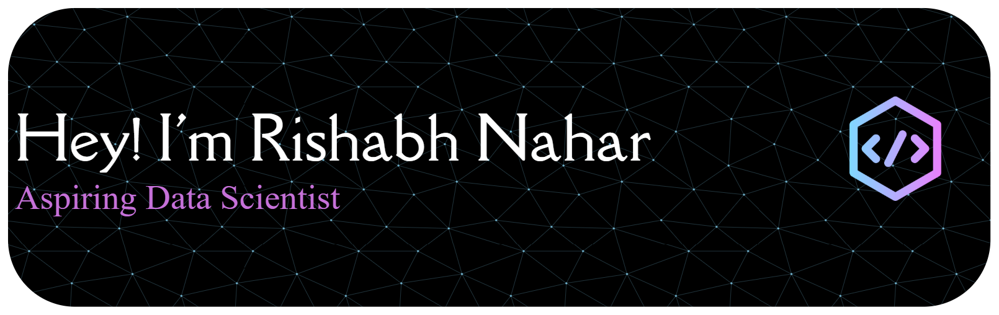

<!-- ═══════════════════════════ HEADER ═══════════════════════════ -->

  

<!-- Typing SVG -->

  

<!-- Social Badges Row -->

  
  &nbsp;
  

 

<!-- ═══════════════════════════ ABOUT ME ═══════════════════════════ -->
<table align="center" width="95%">
<tr>
<td width="55%" valign="top">

<h2>👨‍💻 About Me</h2>

🎓 **Final-year CS student** passionate about real-world software

🔭 Currently exploring **Machine Learning · DSA · Full-Stack**

🌱 Learning **Python · React · Node.js · ML Algorithms**

💡 Strong foundation in **C · C++ · Java · Data Structures**

🤝 Open to collaboration on **exciting open-source projects**

📝 I write tech articles on **[Medium](https://medium.com/@rishabhnahar18)**

📫 Reach me at **rishabhnhr18@gmail.com**

⚡ Fun fact: *I turn caffeine into code!* ☕

</td>
<td width="45%" align="center" valign="middle">

</td>
</tr>
</table>

 

<!-- ═══════════════════════════ SKILLS ═══════════════════════════ -->

  <h2>🛠️ Tech Stack & Skills</h2>

<table align="center" width="90%">
<tr>
<td align="center" width="50%">

**💻 Languages**

</td>
<td align="center" width="50%">

**🌐 Web & Frameworks**

</td>
</tr>
<tr>
<td align="center">

**🗄️ Databases & Cloud**

&nbsp;

</td>
<td align="center">

**🔧 Tools & Platforms**

</td>
</tr>
</table>

 

<!-- Currently Working On Banner -->

  

 

<!-- ═══════════════════════════ GITHUB STATS ═══════════════════════════ -->

  

  
  &nbsp;
  

 

  

 

  

 

<!-- ═══════════════════════════ TROPHIES ═══════════════════════════ -->

  <h2>🏆 GitHub Trophies</h2>
  

 

<!-- ═══════════════════════════ SNAKE ═══════════════════════════ -->

  <h2>🐍 Watch My Contributions Get Eaten!</h2>
  <picture>
    <source media="(prefers-color-scheme: dark)" srcset="https://raw.githubusercontent.com/rishabhnhr18/rishabhnhr18/output/github-contribution-grid-snake-dark.svg"/>
    <source media="(prefers-color-scheme: light)" srcset="https://raw.githubusercontent.com/rishabhnhr18/rishabhnhr18/output/github-contribution-grid-snake.svg"/>
    
  </picture>

 

<!-- ═══════════════════════════ ACTIVITY GRAPH ═══════════════════════════ -->

  

 

  
  &nbsp;
  
  &nbsp;
  
  &nbsp;
  
  &nbsp;
  
  &nbsp;
  

 

<!-- ═══════════════════════════ BLOG POSTS ═══════════════════════════ -->

  <h2>📝 Latest Blog Posts</h2>

  

<!-- ═══════════════════════════ QUOTE ═══════════════════════════ -->

  

 

<!-- ═══════════════════════════ FOOTER ═══════════════════════════ -->

  
   
  
    <b>⭐ If you find my work interesting, consider giving a star!</b> 
    <i>I love connecting with people — drop me a message anytime 😊</i>
  
    
  

